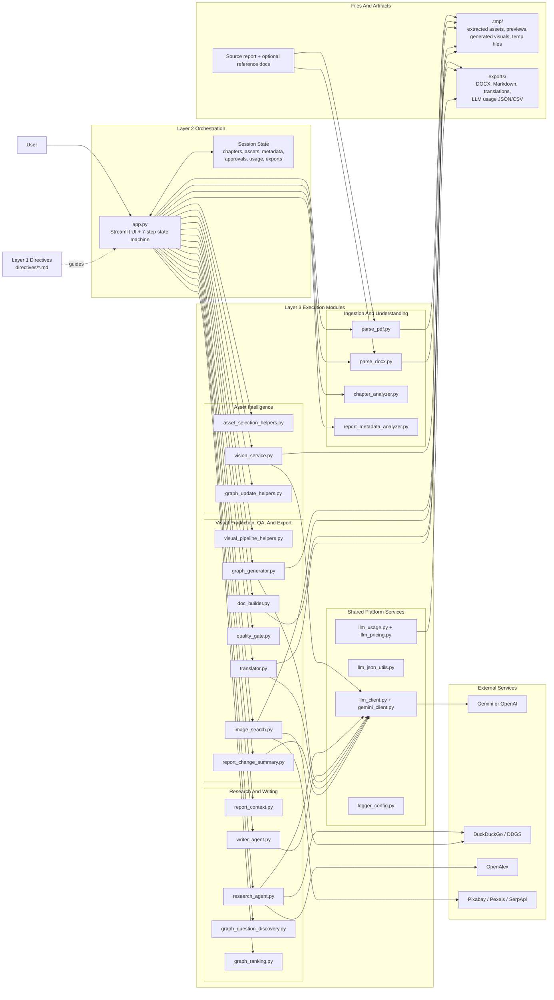
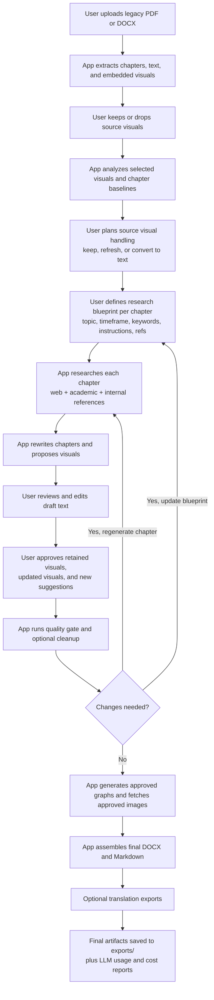

# Report App Architecture Schematics

These schematics reflect the current implementation in `app.py`, `PROJECT_OVERVIEW.md`, and the `execution/` layer.

## 1. Functional And Modular Architecture

### Read This Diagram As

- `app.py` is the orchestration hub and owns the end-to-end workflow.
- `directives/` defines intended behavior, while `execution/` performs deterministic work.
- `llm_client.py` centralizes provider routing so Gemini and OpenAI stay behind one contract.
- `.tmp/` holds regenerable intermediates; `exports/` holds user-facing deliverables.

## 2. Usage And Operating Flow

### Presentation Summary

- The app is not a single prompt; it is a staged modernization pipeline.
- The user makes approval decisions at three control points: source visuals, research blueprint, and final draft/visual approval.
- AI is used inside bounded stages, while export, validation, and file assembly stay deterministic.
