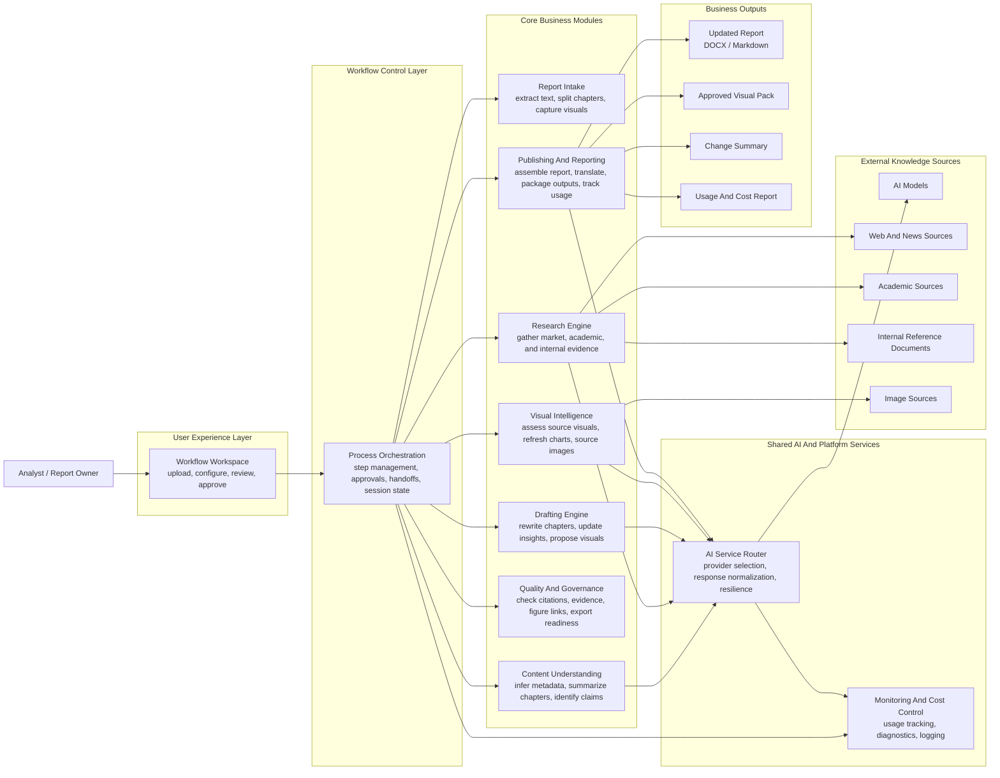
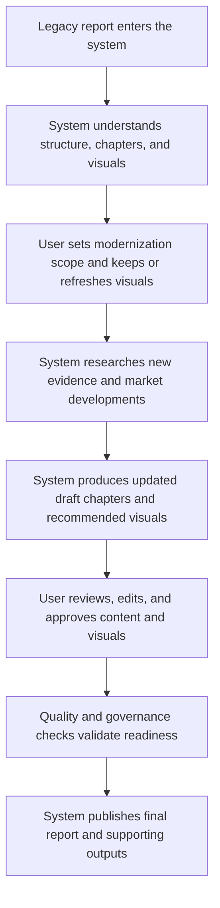
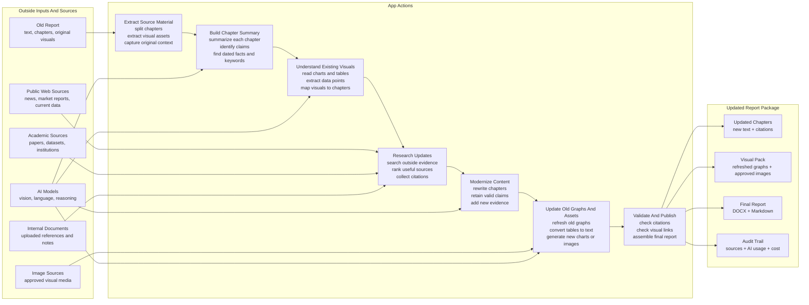

# Report App Architecture

## CEO Presentation Version

This version is intentionally high-level. It emphasizes business modules and what each module does, rather than implementation files.

## 1. Executive Functional Architecture

### Executive Readout

- The app behaves like a guided production line for modernizing legacy reports.
- Human approval remains in the loop at key checkpoints, while AI accelerates analysis, research, writing, and visual refresh.
- Governance is built in through evidence checks, citation validation, and usage tracking.

## 2. Executive Usage Flow

### Boardroom Summary

- Input: a legacy report.
- Core value: the system turns static historical material into a current, evidence-backed edition.
- Output: a polished updated report with visuals, traceability, and optional multilingual delivery.

## 3. Simplified Source-To-Report Flow

### Simple Talk Track

- The app starts with the old report and pulls it apart into chapters, visual assets, claims, dates, and topics.
- It brings in outside sources only where they are needed: public web, academic evidence, internal references, image sources, and AI models.
- The main business action is modernization: update chapter content, refresh old graphs, add citations, validate quality, and publish a clean report package.

## 4. One-Slide Talk Track

- Ingest and understand the original report.
- Research what has changed since publication.
- Rewrite the report into a current edition.
- Refresh visuals and recommendations.
- Validate quality before publishing.
- Deliver the final report with transparency on sources and AI usage.
