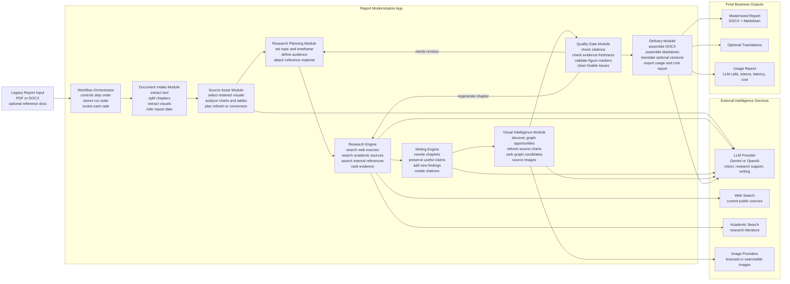
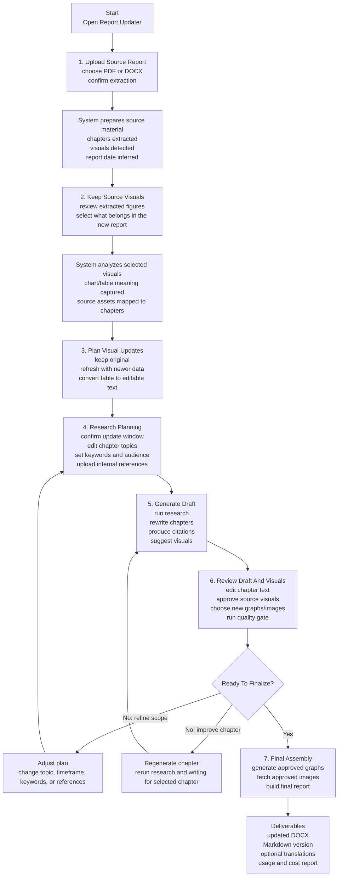
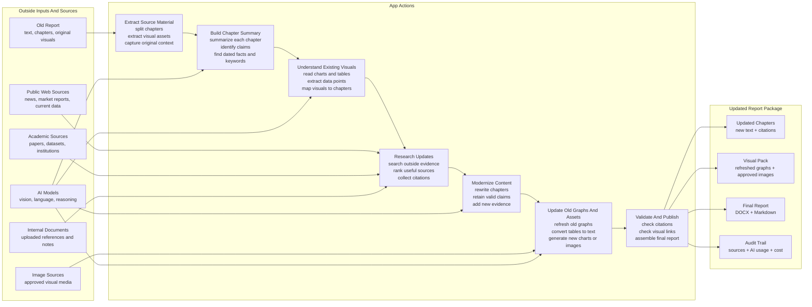

# Report App Architecture Schematics For CEO Presentation

This version avoids implementation-level file names and presents the app as business capabilities, decision points, and user-facing flow.

## 1. App Modules: Logic And Flow

### Executive Readout

- The app is a controlled modernization pipeline, not a one-shot AI prompt.
- Each module has a clear business function: understand the old report, research what changed, rewrite with evidence, improve visuals, validate quality, and export.
- Human review is built into the process before final delivery.
- AI is used for judgment-heavy tasks, while document handling, validation, visual rendering, and export are handled by deterministic modules.

## 2. User UI Process: Screen Flow

### Slide Talking Points

- The user stays in control of scope, source visuals, evidence settings, draft text, and final visual approvals.
- The app reduces manual report refresh work by sequencing research, drafting, visual production, QA, and export.
- The final output is not just text. It includes refreshed visuals, citations, translations when needed, and a cost/usage audit trail.

## 3. Simplified Source-To-Report Flow

### Simple Talk Track

- The app starts with the old report and pulls it apart into chapters, visual assets, claims, dates, and topics.
- It brings in outside sources only where they are needed: public web, academic evidence, internal references, image sources, and AI models.
- The main business action is modernization: update chapter content, refresh old graphs, add citations, validate quality, and publish a clean report package.
